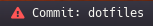

<p align="center">
  
  <h3 align="center">Polybar info git</h3>
</p>

## Configuration
- edit the `DIRS` and `NAMES` variables in the script with the repositories that
you want to monitor
- edit the `diff_message` variable if you want a custom alert message

## Screenshots


## Polybar config
```
[module/info-git]
type = custom/script

exec = ~/.config/polybar/scripts/info-git.sh
interval = 60

label=%output%
label-foreground = ${colors.foreground}

format-prefix = "# "
;format-prefix-alt = " "
format-prefix-foreground = ${colors.alert}
```
